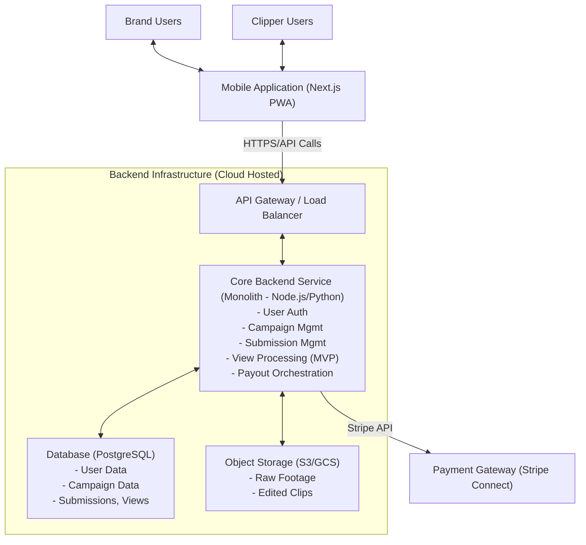

# System Architecture Diagram

This page displays the System Overview (Logical Architecture) diagram for ContentFlow MVP.

The diagram illustrates the main components of the system and their primary interactions.

***

**Key Components:**

* **Users:** Brand Users, Clipper Users.
* **Mobile Application:** The Next.js PWA serving as the frontend.
* **Backend Infrastructure:** Hosted on a cloud platform, including:
  * API Gateway / Load Balancer
  * Core Backend Service (handling main application logic)
  * Database (PostgreSQL)
  * Object Storage (for media files)
* **Payment Gateway:** External service (Stripe Connect) for payment processing.

